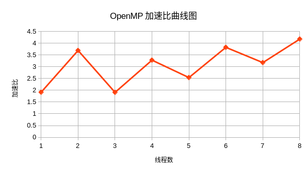

# 实现细节

## 问题与解决方案

Mandelbrot集合计算比较简单，并不需要对算法本身进行优化，我们只需要从程序的角度出发让代码跑的更快、CPU利用率更高即可。

以下是我在优化过程中遇到的问题与相关的解决办法：

*如何精确评估程序性能？*

答：原先仅仅使用墙钟时间，但是这个粒度还是太粗了，因此我选择使用`perf stat`能够查看程序在运行过程中各部分耗时情况：

```
perf stat  ./simd 1 -2 2 -2 2 800 400 homework.png
time elapsed: 0.297305

 Performance counter stats for './simd 1 -2 2 -2 2 800 400 homework.png':

            995.78 msec task-clock:u                     #    3.107 CPUs utilized             
                 0      context-switches:u               #    0.000 /sec                      
                 0      cpu-migrations:u                 #    0.000 /sec                      
               499      page-faults:u                    #  501.115 /sec                      
     2,520,066,779      cycles:u                         #    2.531 GHz                       
     8,316,517,760      instructions:u                   #    3.30  insn per cycle            
     1,065,962,142      branches:u                       #    1.070 G/sec                     
           438,185      branch-misses:u                  #    0.04% of all branches           
    10,538,614,940      slots:u                          #   10.583 G/sec                     
     8,524,084,725      topdown-retiring:u               #     79.6% Retiring                 
       254,785,340      topdown-bad-spec:u               #      2.4% Bad Speculation          
       533,034,942      topdown-fe-bound:u               #      5.0% Frontend Bound           
     1,392,578,141      topdown-be-bound:u               #     13.0% Backend Bound            

       0.320480730 seconds time elapsed

       0.996939000 seconds user
       0.000000000 seconds sys
```

可以看到，除了有墙钟时间（第2行）外，我们可以清楚看到在这段时间之内程序的ipc性能（insn per cycle）、流水线老化情况（Retiring）、分支预测错误数量（Bad Speculation）等，都是我们关注的指标。

另外，还可以通过`perf report`的方式查看热点代码，进行针对性优化，示例分析结果如下所示：
```
Samples: 3K of event 'cycles:u', 4000 Hz, Event count (approx.): 2533801464
main._omp_fn.0  /home/yveswong/mandelbrot-omp/simd [Percent: local period]
Percent+       vmovsd      (%rcx),%xmm3
       +     if (!finished[v] && __builtin_expect(dis > 4, 0)) {
 16.92 +       cmpb        $0x0,(%rdi,%rdx,1)
       +     auto const yyyy = yy[v] * yy[v];
  0.03 +       vmulsd      %xmm3,%xmm3,%xmm5
       +     double x0 = (i + v) * ii + left;
       +       vmovsd      %xmm0,%xmm0,%xmm1
       +     auto const xxxx = xx[v] * xx[v];
 14.34 +       vmovsd      (%rax),%xmm0
       +     double x0 = (i + v) * ii + left;
       +       vfmadd132sd %xmm9,%xmm10,%xmm1
       +     auto const xxxx = xx[v] * xx[v];
       +       vmulsd      %xmm0,%xmm0,%xmm4
       +     auto const xxyy = xx[v] * yy[v];
       +       vmulsd      %xmm3,%xmm0,%xmm3
       +     newxx[v] = xxxx - yyyy + x0;
 18.09 +       vsubsd      %xmm5,%xmm4,%xmm2
       +     newyy[v] = 2 * xxyy + y0;
       +       vfmadd132sd %xmm8,%xmm6,%xmm3
       +     newxx[v] = xxxx - yyyy + x0;
  0.28 +       vaddsd      %xmm1,%xmm2,%xmm1
       +     yy[v] = newyy[v];
  0.03 +       vmovsd      %xmm3,(%rcx)
       +     xx[v] = newxx[v];
 13.50 +       vmovsd      %xmm1,(%rax)
       +     if (!finished[v] && __builtin_expect(dis > 4, 0)) {
  1.14 +     ↓ jne         19c
       +     auto const dis = xxxx + yyyy;
  0.03 +       vaddsd      %xmm5,%xmm4,%xmm4
       +     if (!finished[v] && __builtin_expect(dis > 4, 0)) {
       +       vcomisd     %xmm11,%xmm4
```

从中我们可以十分清楚的看到`-O3`优化之后代码被改写成什么样子、指令的规整程度等，都会影响程序的性能。


## 任务分块

因为算法所计算的每个像素点都是独立的，因此我们也便将整个图进行划分，将二维图片两个维度融合划分给机器所支持的最大线程数。

```cpp
#pragma omp parallel for collapse(2)
  for (int j = 0; j < height; ++j) {
    for (int i = 0; i < width; i += vec_size) { // tiling to 8.
```

同时可以看到，在`i`轴上我们强制线程必须分到`vec_size`倍数的任务，因为我们希望使用`avx512`指令集对该部分运算进行加速。

具体而言，因为参与运算的数字都是`double`类型，因此`vec_size`我们取8能够最大化利用。

核心计算逻辑如下：

```cpp
alignas(vec_size * sizeof(char)) char finished[vec_size] = {0};

alignas(vec_size * sizeof(double)) double xx[vec_size] = {0.0};
alignas(vec_size * sizeof(double)) double yy[vec_size] = {0.0};

alignas(vec_size * sizeof(double)) double newxx[vec_size];
alignas(vec_size * sizeof(double)) double newyy[vec_size];

auto const image_p = image + j * width + i;

for (size_t repeats = 0; repeats < MAX_ITER; ++repeats) {

#pragma omp simd aligned(finished, xx, yy, newxx, newyy)
  for (size_t v = 0; v < vec_size; ++v) {
    double y0 = j * jj + lower;
    double x0 = (i + v) * ii + left;

    auto const xxxx = xx[v] * xx[v];
    auto const yyyy = yy[v] * yy[v];
    auto const xxyy = xx[v] * yy[v];

    newxx[v] = xxxx - yyyy + x0;
    newyy[v] = 2 * xxyy + y0;

    xx[v] = newxx[v];
    yy[v] = newyy[v];

    auto const dis = xxxx + yyyy;

    if (!finished[v] && __builtin_expect(dis > 4, 0)) {
      finished[v] = 1;
      image_p[v] = repeats;
    }
  }

  size_t all_finished = 1;

  for (size_t v = 0; v < vec_size; ++v) {
    all_finished &= finished[v];
  }

  if (all_finished) {
    break;
  }
}
```

可以看到与原算法相比（如下），通过显式的方式进行一个长度为8的循环，将提示omp将其优化为avx相关指令集，从而消除循环。（具体请见前文关于`perf report`部分的内容）。
```c
int repeats = 0;
double x = 0;
double y = 0;
double length_squared = 0;
for (;repeats < MAX_ITER && length_squared < 4;++repeats) {
    double temp = x * x - y * y + x0;
    y = 2 * x * y + y0;
    x = temp;
    length_squared = x * x + y * y;
}
image[j * width + i] = repeats;
```

在`xxxx`，`yyyy`部分为什么要进行拆分呢？一方面是因为这部分在原算法当中存在重复计算的问题，另一方面笔者通过`perf report`发现该部分在不拆分的情况下存在性能问题，因此对此进行了优化。

#  分析与实验

实验部分笔者已经将一些常用实验命令写入`Makeifle`，下文将分别介绍各个benchmark的性能情况。

## 测量程序运行时间

首先是原先算法的性能：

```
$ make perfseq
perf stat  ./seq 1 -2 2 -2 2 800 400 homework.png
time elapsed: 1.182727

 Performance counter stats for './seq 1 -2 2 -2 2 800 400 homework.png':

          1,197.79 msec task-clock:u                     #    0.999 CPUs utilized             
                 0      context-switches:u               #    0.000 /sec                      
                 0      cpu-migrations:u                 #    0.000 /sec                      
               469      page-faults:u                    #  391.555 /sec                      
     4,147,239,524      cycles:u                         #    3.462 GHz                       
     5,608,307,818      instructions:u                   #    1.35  insn per cycle            
       626,505,753      branches:u                       #  523.052 M/sec                     
           298,454      branch-misses:u                  #    0.05% of all branches           
    20,682,925,235      slots:u                          #   17.268 G/sec                     
     5,191,008,686      topdown-retiring:u               #     25.1% Retiring                 
       243,328,532      topdown-bad-spec:u               #      1.2% Bad Speculation          
       162,219,021      topdown-fe-bound:u               #      0.8% Frontend Bound           
    15,086,368,994      topdown-be-bound:u               #     72.9% Backend Bound            

       1.198513497 seconds time elapsed

       1.198545000 seconds user
       0.000000000 seconds sys
```

运行时间：1.182727秒，同时可以看到流水线严重不饱和。

经过优化的最终版本：
```
$ make perfsimd

perf stat  ./simd 1 -2 2 -2 2 800 400 homework.png
time elapsed: 0.283571

 Performance counter stats for './simd 1 -2 2 -2 2 800 400 homework.png':

            972.00 msec task-clock:u                     #    3.195 CPUs utilized             
                 0      context-switches:u               #    0.000 /sec                      
                 0      cpu-migrations:u                 #    0.000 /sec                      
               501      page-faults:u                    #  515.435 /sec                      
     2,628,328,256      cycles:u                         #    2.704 GHz                       
     8,323,131,333      instructions:u                   #    3.17  insn per cycle            
     1,067,806,660      branches:u                       #    1.099 G/sec                     
           359,247      branch-misses:u                  #    0.03% of all branches           
    10,766,986,375      slots:u                          #   11.077 G/sec                     
     8,538,682,777      topdown-retiring:u               #     77.6% Retiring                 
       338,256,241      topdown-bad-spec:u               #      3.1% Bad Speculation          
       445,557,838      topdown-fe-bound:u               #      4.1% Frontend Bound           
     1,677,324,105      topdown-be-bound:u               #     15.2% Backend Bound            

       0.304268261 seconds time elapsed

       0.965114000 seconds user
       0.007956000 seconds sys
```

运行时间: 0.283571秒，相比原程序加速比：4.17x。

## 加速比变化

下面的benchmark在Intel i5-1035G1 (8) @ 3.600GHz平台进行，记录程序内对热点代码测定的墙钟时间，分别将任务绑在0-8个核心查看性能情况。

| 线程数  | 运行时间   | 
|-------- | ---------- | 
|基准     | 1.182727   |
| 1       | 0.617532   |
| 2       | 0.320315   |
| 3       | 0.619277   |
| 4       | 0.360475   |
| 5       | 0.465693   |
| 6       | 0.309175   |
| 7       | 0.372378   |
| 8       | 0.283079   |

可以得到如下加速比曲线：


